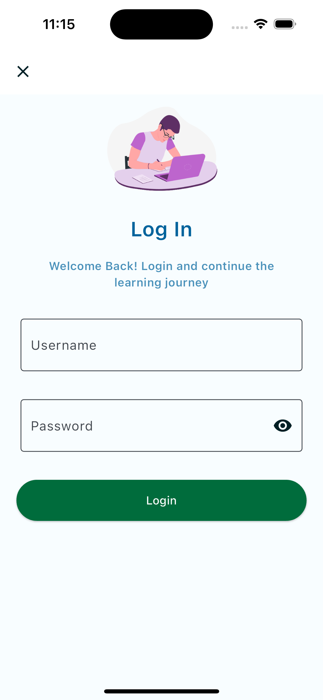
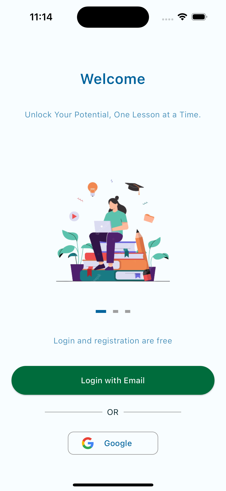
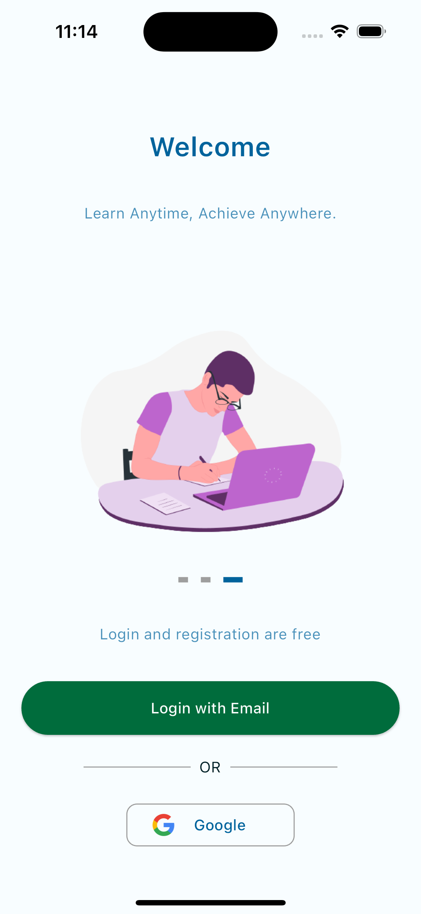
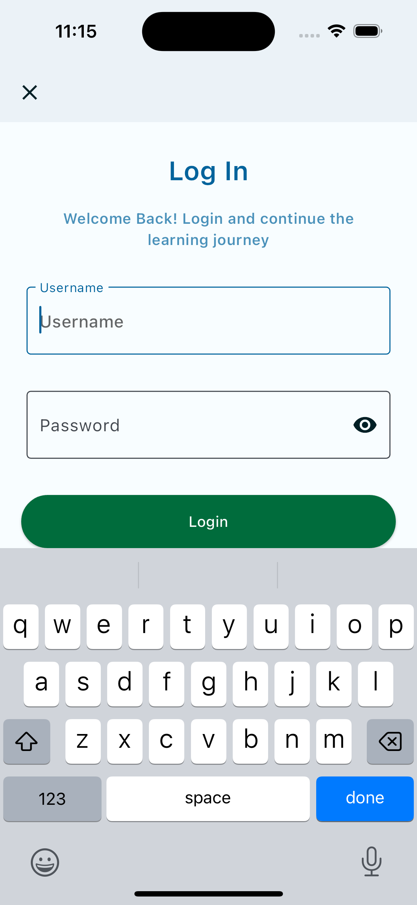

# Flutter UI (Learning Platform)

This project is a personal UI practice in Flutter, focusing on creating an aesthetically pleasing and user-friendly application interface. 

## Inspiration

The UI design was inspired by a [Dribbble shot](https://dribbble.com/shots/7728855-Youth-Education-Launch-Login-Page) which depicts an elegant and youthful design for an education app's login page.

## Implementation

Below are screenshots of the implemented UI in this practice project:

### Login Screen



### Onboarding Screen



### Carousel Widget

<p float="left">
  
   
</p>


### Selected TextField Widget




## Notes

- This project was developed for practice and exploration of UI creation in Flutter.
- It does not function as a real app but serves to visualize and implement designs in Flutter.
- Feedback, suggestions, and pull requests are always welcome!

## Running the Project

1. Make sure you have Flutter installed on your local machine. For more instructions on how to install Flutter, look [here](https://flutter.dev/docs/get-started/install).
2. Clone the project.
3. Run `flutter pub get` to install the necessary packages.
4. Run `flutter run` to start the project.

## Dependencies Used

### dots_indicator

This project utilizes the [`dots_indicator`](https://pub.dev/packages/dots_indicator) package to indicate the position of the current page view in the carousel. 

To install this package, add the following dependency to your `pubspec.yaml` file:

```
yaml
dependencies:
  dots_indicator: ^2.0.0
```

## Acknowledgements

- Design inspiration from [Dribbble](https://dribbble.com/shots/7728855-Youth-Education-Launch-Login-Page).
